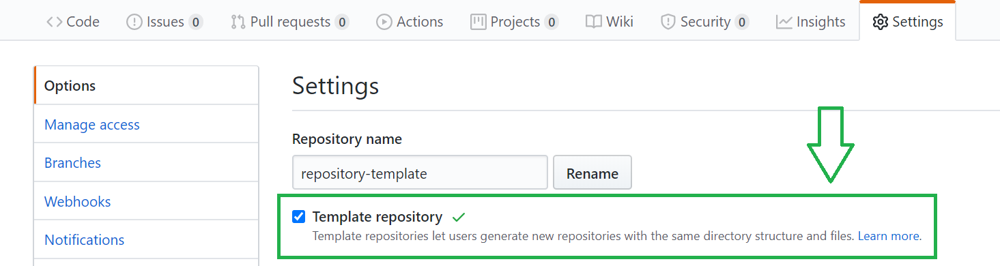
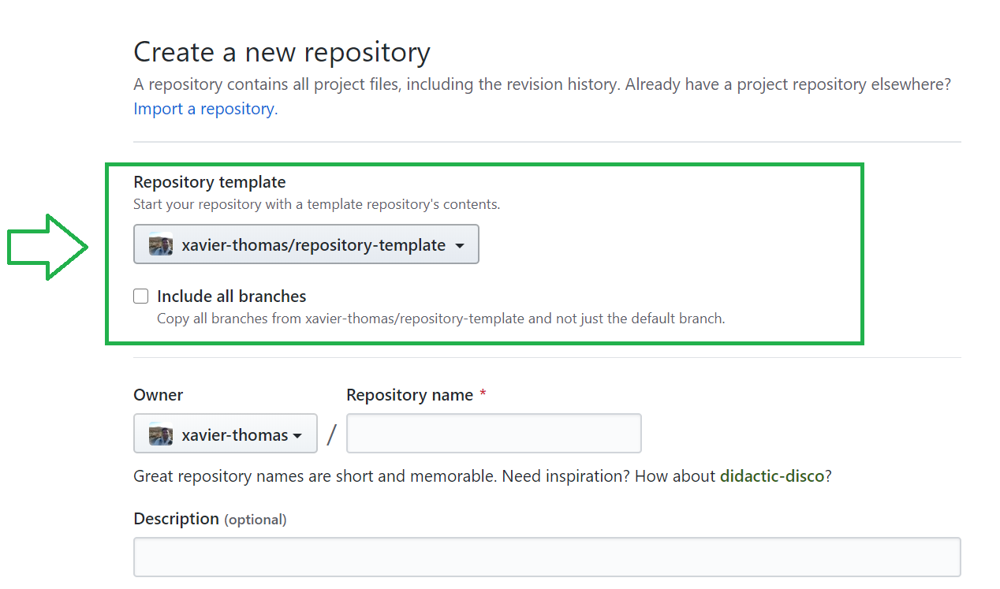

	

<h1 align="center">Repository Template</h1>

    <a href="#overview">Overview</a> |
	<a href="#instructions">Instructions</a> |
  	<a href="#authors">Authors</a> |
  	<a href="#licence">Licence</a>

## Overview

Whilst this repository is primarily geared towards providing myself with a standard repository template, it can be used by anyone.

## Instructions

You can fork this repository and set it as a template.
This will allow it to be used as a template to initialise new repositories.
Once the repository has been initialised with the base files, edit as required.

 
Set the repository as a template here from the settings page.

	

 
When you create a new repository you will be able to select the template.

	

## Authors
**[Xavier Thomas](https://github.com/xavier-thomas)**

## Licence
**[3-Clause BSD](./LICENCE)**
